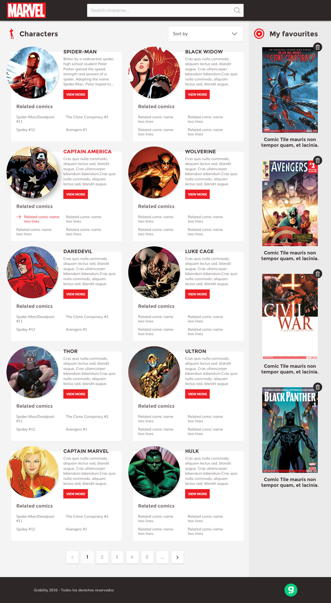

<h1>Test Frontend Grability</h1>

<strong>Prueba de habilidades técnicas frontend developer</strong>

Preparación de la interfaz principal del sitio a construir.

<strong>Primera fase de desarrollo</strong>

En esta primera fase se construye la interfaz principal usando tecnologías web como Bootstrap framework (adaptabilidad en dispositivos móviles), HTML5, CSS3 y LESS. Esta primera parte de maquetación representa el punto de partida para ejecutar el script que contiene la <strong>API de Marvel</strong>

<ol>
<h4>Tareas realizadas</h4>
<li>Diagramación/maquetación con Bootstrap framewok.</li>
<li>Optimización con CSS3 y pre-procesadores de estilos LESS.</li>
<li>Desarrollo y ajustes para dispositivos móviles.</li>
<li>Preparación del área de trabajo y directorio de archivos.</li>
</ol>
